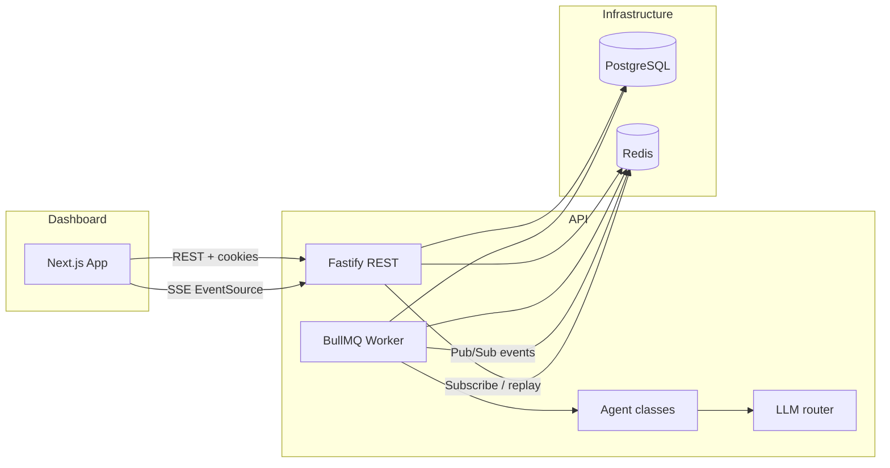

# AgentForge — Purpose, Architecture & Features

This document is the **single reference** for what the app is for, how it is structured, and which capabilities exist today. Use it to onboard, review scope, or sanity-check features against the codebase.

---

## Purpose

**AgentForge** is a **developer platform for orchestrating and observing multi-agent LLM pipelines**. Users define pipelines as graphs of agent nodes (e.g. PM → Architect → Engineer → QA → Deploy), run them with a text input, and monitor execution in a real-time dashboard—similar in spirit to observability plus workflow tools, but focused on **AI agent runs**, **token/cost tracking**, and **structured handoffs** between steps.

It is **not** a general no-code automation product: it targets developers who want visibility and control over multi-step agent workflows.

---

## What You Can Do (Feature Surface)

| Area | Purpose |
|------|---------|
| **Overview** | High-level stats: run counts, success rate, tokens, estimated cost. |
| **Pipelines** | List and inspect pipelines; each has a JSON **definition** (nodes + edges) and optional **trigger** (manual, webhook, schedule metadata in UI). |
| **Builder** | Visual pipeline editor (React Flow): arrange agents, configure models/tools, set triggers including cron-style **schedule** fields stored on the definition. |
| **Runs** | List runs, filter, open a run; **live log stream** via SSE when connected to the API stream endpoint. |
| **Agents** | Browse configured agent roles tied to the product (PM, Architect, Engineer, QA, Deploy, custom). |
| **Tools** | Catalog of tools agents may use (e.g. web search, sandbox file read/write, sandboxed code execution)—documented in the UI. |
| **Cost** | Cost-related dashboard surface (aligned with token/cost data on runs). |
| **Usage** | Workspace usage metrics (API-backed usage routes). |
| **Alerts** | Workspace alerts (e.g. cost threshold, failure rate) with optional Slack/webhook/email notification fields. |
| **Settings** | Workspace and session-oriented settings (API keys, workspace membership). |
| **Auth** | Email/password (and account model supports OAuth-style accounts); **Better Auth** session cookies; middleware protects dashboard routes. |

**External integration:** `POST` webhook routes trigger pipelines by **workspace API key** (`X-API-Key`), in addition to browser session auth.

**API documentation:** Fastify serves **OpenAPI** with **Scalar** UI at `/docs` (local default: `http://localhost:3001/docs`).

---

## System Architecture (Logical)



- **Web (`apps/web`)** — Next.js App Router dashboard; calls the API with credentials; run detail uses **Server-Sent Events** against `GET /runs/:id/stream` on the API for live updates.
- **API (`apps/api`)** — Fastify: pipelines, runs, workspaces, stats, webhooks, auth hooks, settings, alerts, usage; **BullMQ** queue for run jobs; **Redis** for the queue and run event pub/sub.
- **Worker** — Same process as the API in `index.ts`: registers agent implementations and processes queued runs (`agent-runner.ts`).
- **Database** — Prisma + PostgreSQL: users, workspaces, pipelines, agent configs, runs, steps, logs, alerts.

---

## Monorepo Layout

```
orchestrationdash/
├── apps/
│   ├── web/          # Next.js — dashboard UI
│   └── api/          # Fastify — REST, worker, SSE
└── packages/
    ├── types/        # Shared TypeScript types
    ├── db/           # Prisma schema & client
    └── ui/           # Shared UI primitives
```

Root scripts (see root `package.json`): `pnpm dev`, `build`, `lint`, `typecheck`, `test`, `db:migrate`, `db:seed`, `db:studio`.

---

## Core Domain Concepts

| Concept | Meaning |
|---------|---------|
| **Workspace** | Tenant boundary: pipelines, runs, API key, members, and alerts belong to a workspace. |
| **Pipeline** | Named workflow; stores a **definition** (`nodes`, `edges`) and **trigger** type. |
| **AgentConfig** | Per-pipeline row: role, display name, model, system prompt, tool allowlist. |
| **Run** | One execution of a pipeline: status, trigger, input text, aggregates for tokens and USD cost. |
| **RunStep** | One node execution within a run: per-step tokens, cost, duration, structured **output** JSON. |
| **Log** | Append-only lines attached to a step (levels: info, warn, error). |
| **Message pool** | Shared JSON context passed between agents for a run (see `message-pool.ts`). |

Agent **roles** in the schema include: `pm`, `architect`, `engineer`, `qa`, `deploy`, `custom`. The worker maps **node role strings** to registered **agent classes** (`PMAgent`, `ArchitectAgent`, etc.).

---

## Execution Flow (Run Lifecycle)

1. Client triggers a run (`POST /runs`) or an external system calls a **webhook** route with the workspace API key.
2. API persists a **Run** (typically `QUEUED`) and enqueues a **BullMQ** job.
3. Worker loads the pipeline definition, **orders nodes** from the graph, builds the initial **message pool** from user input.
4. For each node: create **RunStep**, instantiate the agent class for that role, run `execute`, record tokens/cost, append **logs**, update the pool for the next step.
5. Events are **published** to Redis; the **SSE** endpoint streams events and can replay history for subscribers.
6. On completion, run status becomes **SUCCESS** or **FAILED**; **alert** rules may be evaluated (cost/failure windows).

---

## Tech Stack (Implemented)

| Layer | Technology |
|-------|------------|
| Dashboard | Next.js (App Router), TypeScript, React |
| API | Fastify, BullMQ, Redis |
| DB | PostgreSQL, Prisma |
| LLM | Vercel AI SDK–style routing in `llm-router.ts` (generate/stream) |
| Auth | Better Auth (session cookies; protected dashboard) |
| Docs | OpenAPI + Scalar (`/docs`) |

---

## Invariants & Conventions (For Contributors)

- **LLM calls** should go through **`llm-router.ts`**, not ad-hoc provider SDK usage in routes.
- **New agent types** extend **`BaseAgent`** and are **registered** in `apps/api/src/index.ts`.
- **Pipeline graph changes** belong in the pipeline **definition** JSON and **AgentConfig** rows; DB schema changes require a Prisma **migration**.
- **SSE** is **read-only** from the client: the dashboard consumes events; control operations use REST.

---

## Related Files

| Topic | Location |
|-------|----------|
| Shared types | `packages/types` |
| Schema | `packages/db/prisma/schema.prisma` |
| Run execution | `apps/api/src/workers/agent-runner.ts` |
| Agents | `apps/api/src/agents/` |
| LLM entrypoint | `apps/api/src/lib/llm-router.ts` |
| Live logs UI | `apps/web/components/runs/LogStream.tsx` |
| Product / design notes | `PROJECT.md`, `CLAUDE.md` |

---

*Last reviewed against the repository layout and routes as of the document’s creation. If something diverges, treat the code as source of truth and update this file in one place.*
